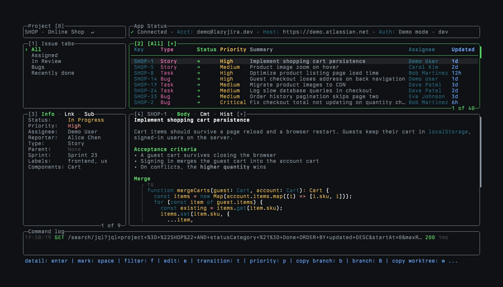

# lazyjira

<p align="center">
  <a href="https://go.dev/"></a>
  <a href="https://github.com/nikbrunner/lazyjira/releases"></a>
  <a href="https://opensource.org/licenses/MIT"></a>
</p>

A keyboard-driven terminal UI for Jira, in the spirit of [lazygit](https://github.com/jesseduffield/lazygit). Browse issues
through your own JQL tabs, read descriptions and comments, change status, priority, and assignee, and turn an issue into a
Git branch or worktree without opening a browser.

Based on the [original project](https://github.com/textfuel/lazyjira), created by textfuel and its contributors. The
original MIT license and copyright notice are preserved in [LICENSE](LICENSE).

<p align="center">
  
</p>

## See it in action

Browsing: the Issues panel is maximized to scroll through 42 issues, and an issue opens in maximized details. Then the
recording switches issue tabs, filters by status with `f`, marks a range with `v`, reads a description and its comments,
runs a JQL search into a temporary tab, and switches to another project.

<p align="center">
  
</p>

Creating an issue: `n` opens an empty form for a bug, the description is written in `$EDITOR`, and priority, assignee,
labels, and components are picked from lists. The new issue then opens with its description.

<p align="center">
  
</p>

Opening an issue by key: `#` starts with the active project, `pl` and `Tab` switch to Platform Services, and `3` finds
PLAT-3, which opens in maximized details until `esc` returns to the workspace.

<p align="center">
  
</p>

## Features

- The workspace has five panes that keep their place: the Project selector, Issue tabs, Issues, Issue info, and Issue
  details. `0` to `4` jump to a pane, `H` `J` `K` `L` move to its neighbour, and `+` maximizes Issues or Details.
- Issue tabs are JQL queries from your config. `s` opens a JQL search with autocomplete, syntax highlighting, and history,
  and shows the result in a temporary tab. `>` opens an issue's children the same way.
- The Issues panel shows the columns you pick (key, type, status, priority, summary, assignee, updated age) and can group
  issues by your workflow's status order.
- `#` opens any issue by its key. The prompt completes the project key, then suggests issues as you type the number.
- `/` filters the loaded issues by text. `f` filters them by status, issue type, and priority, with counts that show what
  each choice leaves.
- `space` and `v` mark issues, and `y` copies the marked rows as plain text.
- Summary, transition, priority, assignee, labels, components, sprint, and parent are edited in place. Description and
  comments open in `$EDITOR`. `n` creates an issue, `ctrl+n` duplicates one, and `S` adds a subtask.
- Issue details renders Jira's rich text, including headings, lists, tables, and highlighted code blocks, next to comments
  and history. `o` opens the issue in the browser and `u` picks a link from the description.
- `b` and `w` copy a branch or worktree name built from the issue. `B` and `W` create the branch or the worktree.
- Custom commands bind shell commands to keys, with the focused issue's fields as shell-escaped template values.
- Colors come from your terminal's color scheme, so lazyjira matches it from the first start. `themeColors` overrides
  single colors when you want to. Borders are rounded or sharp.
- lazyjira works with Jira Cloud and Jira Server / Data Center, including client certificates (mTLS).

## Try the demo

The demo runs against built-in fake data, so it needs no Jira account:

```sh
git clone https://github.com/nikbrunner/lazyjira.git
cd lazyjira
make build-demo
LAZYJIRA_CONFIG_DIR=e2e/demo-config ./lazyjira-demo --demo
```

`e2e/demo-config/config.yml` sets up the tabs and columns shown above. Without `LAZYJIRA_CONFIG_DIR`, the demo uses your
own config.

## Installation

On macOS or Linux, the install script downloads the latest release, checks it against the release checksums, and installs
it to `~/.local/bin`:

```sh
curl -fsSL https://raw.githubusercontent.com/nikbrunner/lazyjira/main/install.sh | sh
```

`VERSION=v0.6.5` pins a release, and `INSTALL_DIR` picks another directory.

With [mise](https://mise.jdx.dev):

```sh
mise use -g github:nikbrunner/lazyjira
```

With Go 1.25.8 or later:

```sh
go install github.com/nikbrunner/lazyjira/cmd/lazyjira@latest
```

Go installs `lazyjira` in `GOBIN` if it is set, or in the `bin` folder under `GOPATH` otherwise. That directory has to be
on your `PATH`. On macOS or Linux, add this to your shell profile:

```sh
go_bin="$(go env GOBIN)"
if [ -z "$go_bin" ]; then
  go_bin="$(go env GOPATH)/bin"
fi
export PATH="$PATH:$go_bin"
```

On Windows, run `go env GOBIN` in PowerShell. If it prints nothing, run `go env GOPATH` and add `\bin` to the end of that
path. Press `Win+R`, enter `sysdm.cpl`, then open Advanced → Environment Variables → your user `Path` → Edit → New. Add
the directory and open a new PowerShell window.

Archives for macOS, Linux, and Windows are also attached to each
[GitHub Release](https://github.com/nikbrunner/lazyjira/releases). Check the install with `lazyjira --version`.

## Setup

Run `lazyjira`. On first launch a setup wizard asks for your Jira type, host, and credentials, and saves them to
`auth.json` in the [config directory](docs/Config.md#config-file-location).

- Jira Cloud needs your email and an [API token](https://id.atlassian.com/manage-profile/security/api-tokens).
- Jira Server / Data Center needs a Personal Access Token from Profile → Personal Access Tokens → Create token.

For client certificates (mTLS), see [TLS](docs/Config.md#tls).

## Usage

```sh
lazyjira                    # start
lazyjira auth               # re-authenticate
lazyjira logout             # clear credentials
lazyjira --dry-run          # read-only mode, no writes to Jira
lazyjira --log app.log      # log API requests to a file
lazyjira --debug debug.log  # write debug logs to a file
lazyjira --version          # show version
```

Press `?` inside the app for all keybindings, and `/` in that popup to filter them.

## Configuration

Settings live in `config.yml` in the [config directory](docs/Config.md#config-file-location), which is
`~/.config/lazyjira` on Linux and `~/Library/Application Support/lazyjira` on macOS. Add only the keys you want to change:

```yaml
gui:
  issueListFields: [key, type, status, priority, summary, assignee, updated]
statusOrder: [To Do, In Progress, In Review, Done]
issueTabs:
  - name: Mine
    jql: project = {{.ProjectKey}} AND assignee = currentUser() AND statusCategory != Done ORDER BY priority DESC
  - name: In Review
    jql: project = {{.ProjectKey}} AND status = "In Review" ORDER BY updated DESC
```

- [Configuration](docs/Config.md): every setting, including colors, issue tabs, Git integration, and custom commands
- [Keybindings](docs/Keybindings.md): the default keys and the pane map
- [Custom Fields](docs/Custom_Fields.md): showing Jira custom fields

## Releases

[release-please](https://github.com/googleapis/release-please) cuts versions and GitHub Releases from
[Conventional Commits](https://www.conventionalcommits.org/). Release notes come from the curated
[CHANGELOG](CHANGELOG.md), and the maintainer process is in [docs/releases.md](docs/releases.md).

Planned work lives in the
[enhancement issues](https://github.com/nikbrunner/lazyjira/issues?q=is%3Aissue%20state%3Aopen%20label%3Aenhancement).

## License

[MIT](LICENSE)
