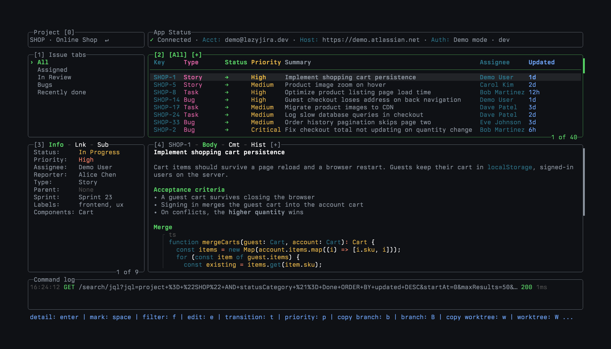
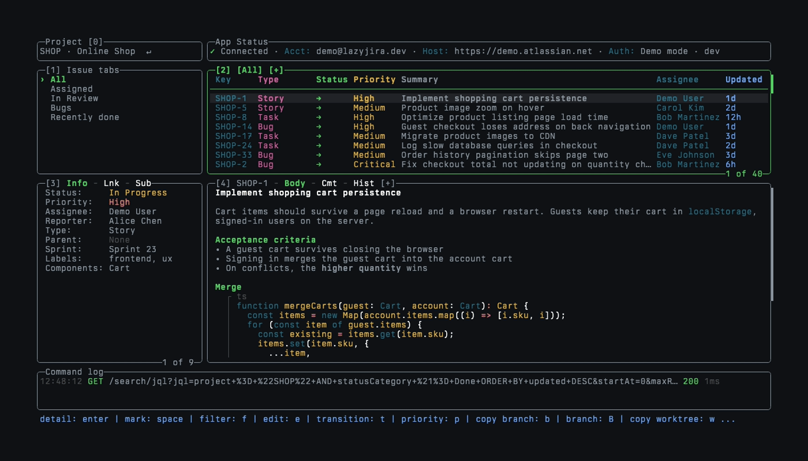
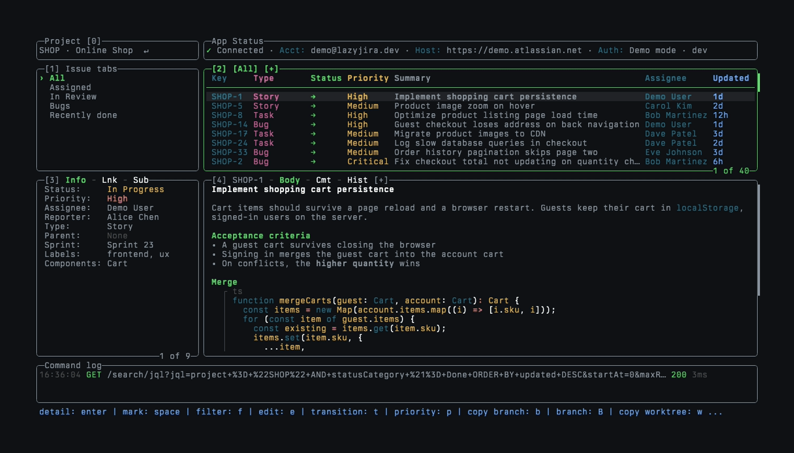
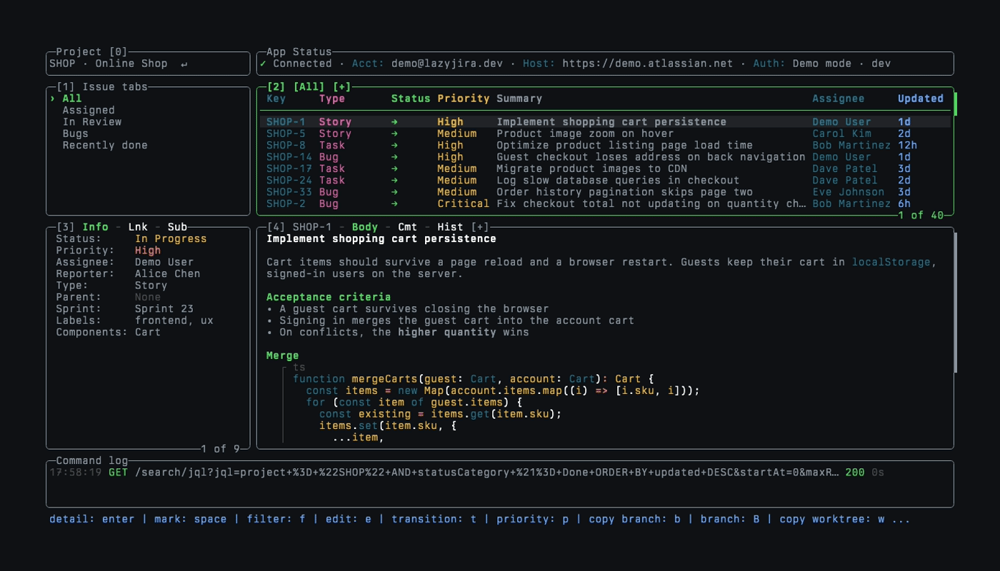

# lazyjira

<p>
  <a href="https://go.dev/"></a>
  <a href="https://github.com/nikbrunner/lazyjira/releases"></a>
  <a href="https://opensource.org/licenses/MIT"></a>
</p>

<p align="center">
  
</p>

A keyboard-driven terminal UI for Jira, in the spirit of [lazygit](https://github.com/jesseduffield/lazygit). Browse issues
through your own JQL tabs, read descriptions and comments, change status, priority, and assignee, and turn an issue into a
Git branch or worktree without opening a browser.

Based on the [original project](https://github.com/textfuel/lazyjira), created by
[textfuel](https://github.com/textfuel) and its contributors. The original MIT license and copyright notice are
preserved in [LICENSE](LICENSE).

## Walkthrough

### Browsing

The Issues panel is maximized to scroll through 42 issues, and an issue opens in maximized details. Then the
recording switches issue tabs, filters by status with `f`, marks a range with `v`, reads a description and its comments,
runs a JQL search into a temporary tab, and switches to another project.

<p align="center">
  
</p>

### Creating an issue

`n` opens an empty form for a bug, the description is written in `$EDITOR`, and priority, assignee,
labels, and components are picked from lists. The new issue then opens with its description.

<p align="center">
  
</p>

### Opening an issue by key

`#` starts with the active project, `pl` and `Tab` switch to Platform Services, and `3` finds
PLAT-3, which opens in maximized details until `esc` returns to the workspace.

<p align="center">
  
</p>

## Try the demo

The demo runs against built-in fake data, so it needs no Jira account:

```sh
git clone https://github.com/nikbrunner/lazyjira.git
cd lazyjira
make build-demo
LAZYJIRA_CONFIG_DIR=e2e/demo-config ./lazyjira-demo --demo
```

`e2e/demo-config/config.yml` sets up the tabs and columns shown above. Without `LAZYJIRA_CONFIG_DIR`, the demo uses your
own config.

## Installation

On macOS or Linux, the install script downloads the latest release, checks it against the release checksums, and installs
it to `~/.local/bin`:

```sh
curl -fsSL https://raw.githubusercontent.com/nikbrunner/lazyjira/main/install.sh | sh
```

`VERSION=v0.6.5` pins a release, and `INSTALL_DIR` picks another directory.

With [mise](https://mise.jdx.dev):

```sh
mise use -g github:nikbrunner/lazyjira
```

With Go 1.25.8 or later:

```sh
go install github.com/nikbrunner/lazyjira/cmd/lazyjira@latest
```

Go installs `lazyjira` in `GOBIN` if it is set, or in the `bin` folder under `GOPATH` otherwise. That directory has to be
on your `PATH`. On macOS or Linux, add this to your shell profile:

```sh
go_bin="$(go env GOBIN)"
if [ -z "$go_bin" ]; then
  go_bin="$(go env GOPATH)/bin"
fi
export PATH="$PATH:$go_bin"
```

On Windows, run `go env GOBIN` in PowerShell. If it prints nothing, run `go env GOPATH` and add `\bin` to the end of that
path. Press `Win+R`, enter `sysdm.cpl`, then open Advanced → Environment Variables → your user `Path` → Edit → New. Add
the directory and open a new PowerShell window.

Archives for macOS, Linux, and Windows are also attached to each
[GitHub Release](https://github.com/nikbrunner/lazyjira/releases). The binaries are not signed, so macOS blocks one
downloaded in a browser; run `xattr -d com.apple.quarantine lazyjira` once to allow it. Check the install with
`lazyjira --version`.

## Features

- Works with Jira Cloud and Jira Server / Data Center, including mTLS.
- Issue tabs are your own JQL queries. `s` searches with autocomplete and history.
- Edit fields in place, description and comments in `$EDITOR`. `n` creates, `ctrl+n` duplicates, `S` adds a subtask.
- `b` and `w` copy a branch or worktree name, `B` and `W` create it.
- Jira rich text renders with headings, lists, tables, and highlighted code. `o` opens the browser, `u` picks a link.
- `#` opens any issue by key, completing the project and the issue number.
- `>` opens an issue's children in a temporary tab, `backspace` its parent.
- `/` filters by text, `f` by status, type, and priority.
- Opened issues and Jira reference data (boards, sprints, users) are cached in memory. `R` refreshes everything.
- Custom commands bind shell commands to keys, with the issue's fields as template values.
- Pick the Issues columns and group issues by your workflow's status order.
- Pick the fields in the Issue info pane, Jira custom fields included.
- Colors follow your terminal's color scheme. `themeColors` overrides single colors.
- `y` copies key and summary, `ctrl+y` a Markdown link, `Y` the URL. With marks, `y` copies the marked rows.
- Five fixed panes: `0` to `4` jump to one, `H` `J` `K` `L` move between them, `+` maximizes.
- Most keys can be remapped. `?` lists them all, and `/` filters that list.

## Setup

Run `lazyjira`. On first launch a setup wizard asks for your Jira type, host, and credentials, and saves them to
`auth.json` in the [config directory](docs/Config.md#config-file-location).

- Jira Cloud needs your email and an [API token](https://id.atlassian.com/manage-profile/security/api-tokens).
- Jira Server / Data Center needs a Personal Access Token from Profile → Personal Access Tokens → Create token.

For client certificates (mTLS), see [TLS](docs/Config.md#tls).

lazyjira only talks to your Jira host. It sends no telemetry and does not check for updates. `auth.json` is readable
only by your user. To try it without touching Jira, start it with `lazyjira --dry-run`. Edits then look like they work,
but they're only logged, never sent.

## Usage

```sh
lazyjira                    # start
lazyjira auth               # re-authenticate
lazyjira logout             # clear credentials
lazyjira --dry-run          # simulate edits, never send them to Jira
lazyjira --log app.log      # log API requests to a file
lazyjira --debug debug.log  # write debug logs to a file
lazyjira --version          # show version
```

Press `?` inside the app for all keybindings, and `/` in that popup to filter them.

## Configuration

Settings live in `config.yml` in the [config directory](docs/Config.md#config-file-location), which is
`~/.config/lazyjira` on Linux and `~/Library/Application Support/lazyjira` on macOS. Add only the keys you want to change:

```yaml
gui:
  issueListFields: [key, type, status, priority, summary, assignee, updated]
statusOrder: [To Do, In Progress, In Review, Done]
issueTabs:
  - name: Mine
    jql: project = {{.ProjectKey}} AND assignee = currentUser() AND statusCategory != Done ORDER BY priority DESC
  - name: In Review
    jql: project = {{.ProjectKey}} AND status = "In Review" ORDER BY updated DESC
```

- [Configuration](docs/Config.md): every setting, including colors, issue tabs, Git integration, and custom commands
- [Keybindings](docs/Keybindings.md): the default keys and the pane map
- [Custom Fields](docs/Custom_Fields.md): showing Jira custom fields

## Jira from scripts and agents

lazyjira is a terminal UI and has no commands for scripts or AI agents. For that, use one of these CLIs:

1. [TWG CLI](https://github.com/atlassian/twg-cli) (`twg`): Atlassian's agent-first CLI for Jira, Confluence, Bitbucket,
   and more. It installs agent skills for Claude Code, Codex, Cursor, pi, and others, and signs in with OAuth. Cloud only.
2. [Atlassian CLI](https://developer.atlassian.com/cloud/acli/) (`acli`): Atlassian's official CLI for Jira Cloud,
   with JSON and CSV output, JQL search, bulk edits, and transitions. Cloud only.
3. [jira-cli](https://github.com/ankitpokhrel/jira-cli) (`jira`): an open-source CLI that also has JSON and CSV output
   for issue lists, and the only choice on this list for Jira Server / Data Center.

## Releases

[release-please](https://github.com/googleapis/release-please) cuts versions and GitHub Releases from
[Conventional Commits](https://www.conventionalcommits.org/). Release notes come from the curated
[CHANGELOG](CHANGELOG.md), and the maintainer process is in [docs/releases.md](docs/releases.md).

Planned work lives in the
[enhancement issues](https://github.com/nikbrunner/lazyjira/issues?q=is%3Aissue%20state%3Aopen%20label%3Aenhancement).

## License

[MIT](LICENSE)
